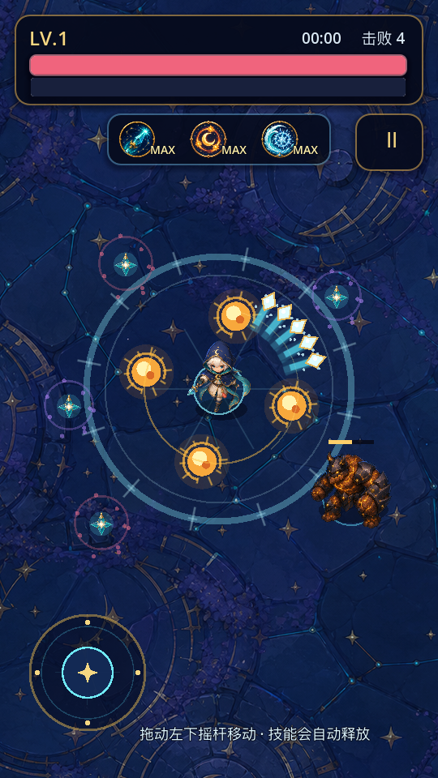
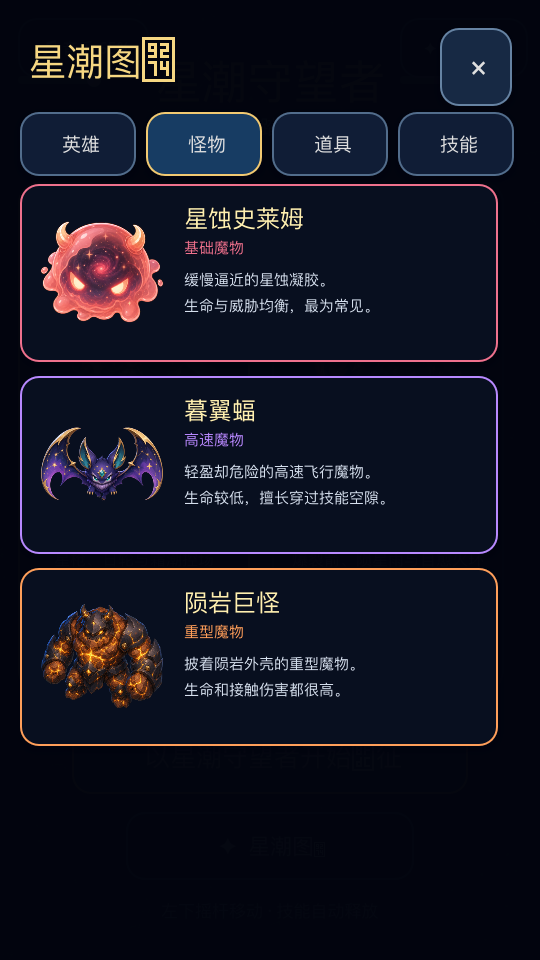
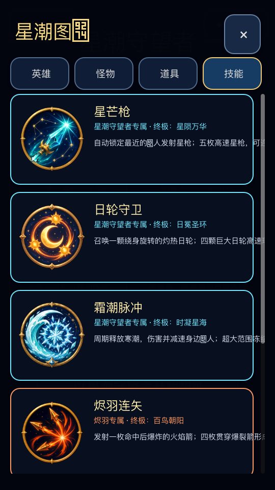
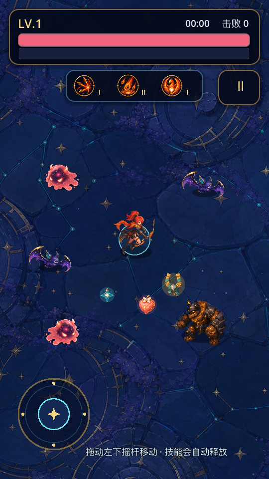
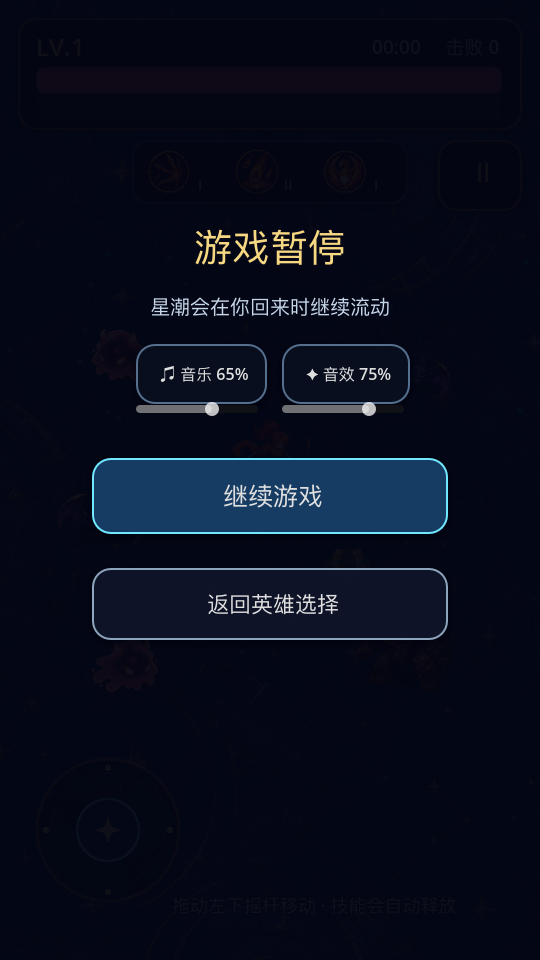
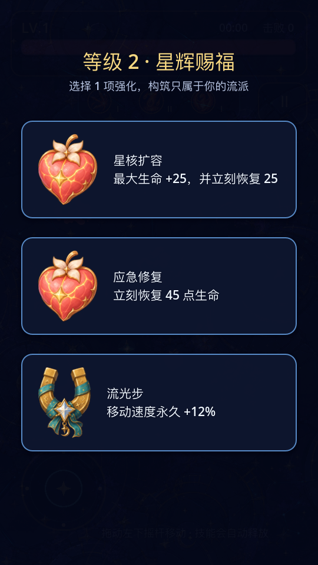

# 星潮守望者

一个基于 Godot 4 的竖屏 2D 肉鸽 MVP。项目包含完整的原创「午夜星辉遗迹」手绘素材，打开即可运行。

## 已完成的玩法闭环

- 键盘 `WASD / 方向键`，或移动端左下虚拟摇杆控制角色。
- 怪物会在玩家四周随机刷新，并随时间提高数量、种类和生命值。
- 技能自动攻击；怪物死亡掉落经验，概率掉落治疗道具或全屏磁吸道具。
- 升级触发三选一。专属技能可重复获取，第 3 级会变为终极技能。
- 两名英雄共六套专属技能，涵盖贯穿、环绕、减速、爆炸、陨星轰击与范围自愈。
- 包含生命值、经验、计时、击杀、技能等级、失败结算和重新开始。
- 包含星象遗迹地图、两名英雄、三类怪物、六套技能图标和全部掉落物素材。
- 开始界面可选择“星潮守望者”或“烬羽”，两名英雄拥有完全独立的技能成长池。
- 游戏内可点击右上角暂停按钮，或按 `Esc` 暂停和继续。
- 两名英雄及三类怪物均包含正面、左向和镜像右向视图，并带平滑转身过渡。
- 包含可循环的原创背景音乐，以及六类技能、命中、受伤、怪物击败、拾取、升级和界面音效；开始页与暂停页均可独立开关并调节音乐、音效音量，设置会在重启后保留。
- 六套技能拥有独立的动态视觉语言：星枪符文尾迹、火箭焰尾、日轮日冕、霜潮冰晶阵、陨星坠落与凤凰展翼。
- 开始界面的“星潮图鉴”可查看 2 名英雄、3 类怪物、3 类道具和 6 套技能的属性与机制说明。

## 当前画面















## 运行方式

1. 安装 Godot 4.3 或更高版本。
2. 在 Godot 项目管理器中导入本目录下的 `project.godot`。
3. 点击右上角运行按钮，或按 `F6/F5`。

项目基准分辨率为 `540 × 960`，会按竖屏等比拉伸。测试电脑端时可直接用鼠标拖动虚拟摇杆。

## 文件结构

```text
main.tscn                   游戏入口
scripts/game.gd             核心循环、战斗、掉落、升级与 UI
scripts/hero_catalog.gd     英雄属性与两套技能成长配置
scripts/compendium_catalog.gd 图鉴条目与分类数据
scripts/audio_manager.gd    背景音乐、音效池与声音开关
scripts/combat_effects.gd   技能爆发与击败特效
scripts/player.gd           玩家表现与生命
scripts/enemy.gd            三类怪物及数值
scripts/projectile.gd       星芒枪弹道与贯穿
scripts/pickup.gd           经验和道具
scripts/virtual_joystick.gd 移动端虚拟摇杆
assets/art/                 原创地图、角色、怪物、技能和掉落物
assets/audio/               原创背景音乐与战斗音效
assets/art/ART_DIRECTION.md 美术规范、生成方式和最终提示词
preview/                    实际运行截图
tools/                      素材处理与截图验证脚本
```

## 推荐的下一阶段

先用 5–10 分钟试玩验证四个问题：移动是否顺手、第一次升级是否足够快、六套技能是否有明显差异、声音是否喧宾夺主。确认核心手感后，再依次加入局外成长、更多角色和关卡；不要在玩法尚未稳定时先搭建复杂的账号或养成系统。
