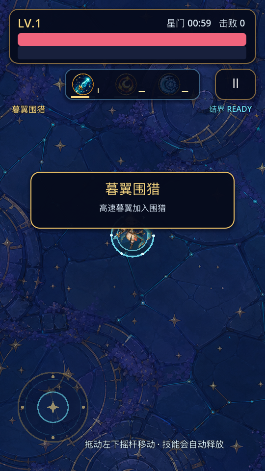
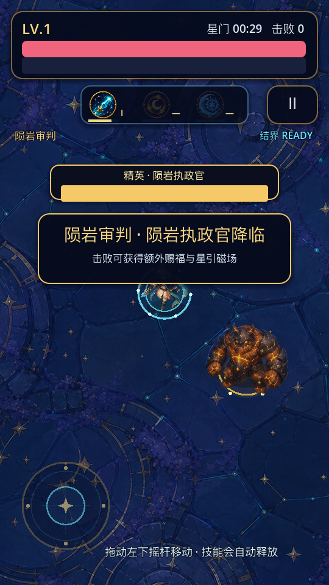

# 星潮守望者

《星潮守望者》是一个使用 Godot 4.7 开发的 2D 竖屏生存肉鸽 MVP。玩家选择英雄与关卡后，只负责移动和走位；英雄自动释放专属技能，击败怪物获取经验，通过升级三选一构筑本局能力，并完成各关独立的生存或精英目标。

当前版本已经形成三关连续解锁的完整战役：

| 顺序 | 关卡 | 时长 | 地图特点 | 胜利条件 | 首通推进 |
| ---: | --- | ---: | --- | --- | --- |
| 1 | 星潮前庭 | 90 秒 | 3200 × 3200，开阔教学场 | 坚持到 90 秒；精英为可选挑战 | 解锁“暮翼回廊” |
| 2 | 暮翼回廊 | 105 秒 | 2100 × 3600，狭长高速围猎 | 击败暮翼女王并坚持到 105 秒 | 解锁“陨岩星核” |
| 3 | 陨岩星核 | 120 秒 | 2200 × 2200，紧凑重型敌潮 | 击败星核暴君并坚持到 120 秒 | 完成当前三关战役 |

## 当前已实现

- 两名可选英雄：星潮守望者、烬羽；生命、移速、固有被动和三项专属技能完全独立。
- 六项英雄专属技能，每项最高 3 级；重复选择可升级，第 3 级转化为终极形态。
- 升级三选一会组合“深化已有技能、解锁未拥有技能、通用成长”，高生命时不投放纯治疗选项。
- 三类普通怪物：均衡型星蚀史莱姆、高速型暮翼蝠、重型陨岩巨怪。
- 三个独立精英事件：陨岩执政官、暮翼女王、星核暴君；生成时机、属性倍率和击败奖励由关卡配置决定。
- 怪物必掉经验，并按关卡概率额外掉落治愈星心或星引护符。
- 三关各自配置地图边界、时长、阶段、刷怪权重、难度曲线、精英、胜利条件、掉落和首通奖励。
- 关卡顺序解锁；英雄战绩与关卡战绩分别持久化，保存出征、通关、精英击败及个人最佳。
- 开始页支持英雄与已解锁关卡选择，并提供英雄、怪物、道具、技能四类图鉴。
- 游戏内暂停、返回主页、同英雄同关卡再战。
- 桌面键盘与移动端浮动摇杆；英雄和怪物具备正面、侧面及左右转身表现。
- 背景音乐和 13 类音效，开始页与暂停页均可开关并调节音乐、音效音量；设置重启后保留。
- 伤害跳字、受击闪烁、镜头震动、击退、短暂无敌、减速表现、技能冷却条、阶段横幅和精英生命条。

## 核心循环

选择英雄与关卡 → 自动战斗与走位 → 击杀、掉落与拾取 → 经验升级三选一 → 技能进化 → 阶段与精英事件 → 独立胜负判定 → 保存战绩和解锁下一关。

经验需求从 28 点开始，后续每升一级增加 20 点。进入战斗时，英雄自动获得其第一项专属技能 I 级；其余技能通过升级选择解锁。

## 操作

| 场景 | 操作 |
| --- | --- |
| 桌面移动 | `WASD` 或方向键 |
| 移动端移动 | 左侧下半屏落指生成浮动摇杆，拖动移动，松手复位 |
| 桌面暂停 | `Esc` |
| 通用暂停 | 游戏右上角暂停按钮 |

项目以 `540 × 960` 作为逻辑设计基准，并使用 `canvas_items + expand` 扩展到实际竖屏比例。全屏背景覆盖完整视口，交互内容按 Android/iOS 安全区布局；超长屏会展示更多纵向游戏世界，不会拉伸画面或添加黑边。

## 运行方式

1. 安装 Godot 4.7 Stable。
2. 在 Godot 项目管理器中导入本目录的 `project.godot`。
3. 打开项目后按 `F6/F5`，或点击编辑器右上角运行按钮。

命令行运行：

```bash
/Applications/Godot.app/Contents/MacOS/Godot --path . --editor
```

如果 Godot 安装在其他位置，请替换命令中的可执行文件路径。

## 当前画面







更多图鉴、两名英雄和终极技能截图位于 `preview/`。

## 项目结构

```text
main.tscn                         游戏入口场景
levels/                           三个独立 LevelConfig 资源
scripts/game.gd                   组合根：界面路由、会话创建、暂停与重开
scripts/levels/                   关卡配置类型、目录、校验与压力模型
scripts/run/                      单局状态、阶段推进、世界装配与结算
scripts/systems/                  怪物、刷怪、投射物、掉落、升级系统
scripts/skills/                   两名英雄的技能运行时与技能控制器
scripts/passives/                 两名英雄的固有被动运行时
scripts/presentation/             地图绘制与战斗反馈
scripts/ui/                       开始页、关卡选择、HUD、暂停、升级、结算、图鉴
scripts/hero_catalog.gd           英雄和六项技能的单一数值来源
scripts/enemy_catalog.gd          三类普通怪物的单一数值来源
scripts/run_records.gd            英雄战绩、关卡战绩与解锁持久化
scripts/audio_manager.gd          音乐、音效池与声音设置持久化
assets/art/                       原创地图、英雄、怪物、技能和掉落物素材
assets/audio/                     1 首背景音乐和 13 类音效
tools/                            自动化校验、冒烟测试与截图工具
docs/                             架构说明和关卡数值说明
```

详细技术边界见 [架构说明](docs/ARCHITECTURE.md)，完整关卡参数见 [关卡数值设计](docs/LEVEL_DESIGN.md)，面向汇报的现状结论见 [游戏现状汇报](游戏现状汇报.md)。

## 自动化验证

在项目根目录执行：

```bash
./tools/run_tests.sh
```

统一入口先加载编辑器，再执行 10 组测试，并把引擎错误、测试缺失或重复执行都视为失败。检查覆盖配置合法性、逐怪物压力公式与增长区间、阶段跨越、刷怪权重和全面屏可见距离、三类胜利边界、旧存档迁移与解锁、两名英雄及技能、完整战役闭环、菜单与暂停流程、4 种屏幕比例和安全区，以及脚本行数和配置层依赖约束。

## Android 导出

仓库已包含名为 `com.xingchao.guardian` 的 Android 导出预设，当前只启用 `arm64-v8a`。安装好 Godot Android 导出模板并配置 Android SDK/JDK 后，可执行：

```bash
/Applications/Godot.app/Contents/MacOS/Godot --headless --path . --export-debug "com.xingchao.guardian" "./星潮守望者.apk"
```

当前工作目录已生成并校验 `星潮守望者.apk`：包名与应用名正确，仅含 `arm64-v8a`，调试签名通过 v2/v3 校验。该包适合内部试玩；正式发布前仍需补齐正式签名、应用图标、商店资料、包体与真机兼容性验证。

## 当前范围与已知限制

- 三关拥有独立边界、色调和刷怪参数，但当前共用同一张地面纹理；尚未制作三套独立地图场景和地形机制。
- 当前局外成长只有关卡解锁和战绩记录，没有货币、装备、天赋树或账号系统。
- 掉落物当前没有数量上限、超时回收或合并机制，需要在长局高击杀真机测试中观察节点数量和帧率。
- 自动化测试已覆盖 `9:16`、`19.5:9`、`20:9` 和 `3:4` 的逻辑布局，但不替代刘海/挖孔真机、安全区上报、性能和长时间稳定性测试。
- 当前定位是内部演示与小范围试玩 MVP，不是可直接上架的商业版本。
