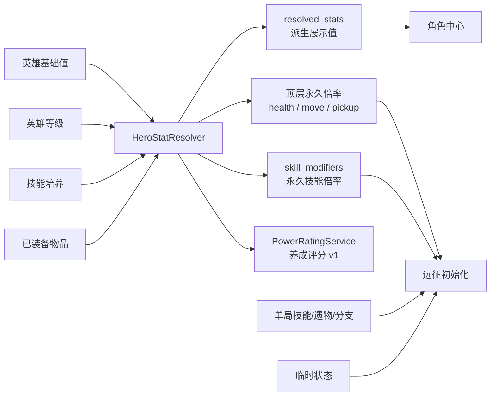

# 《星潮守望者》战力系统与角色属性系统

> 文档状态：数值专家已审阅；第一阶段决策与采集契约 v2 已实施，尚未达到校准样本门槛  
> 更新日期：2026-08-12  
> 适用范围：角色常驻成长、装备、技能培养、单局构筑、养成评分、聚合战斗样本与防御实验预案  
> 核心原则：本文将“当前已实现规则”和“建议方案”严格分开；标记为建议的内容尚未进入运行时。

## 1. 结论摘要

当前项目存在两套相互关联、但职责不同的数值：

1. **角色属性**决定真实战斗结果，例如实际生命、移动速度、技能伤害倍率和技能间隔。
2. **综合战力**的正式产品语义是“养成评分”：它是局外成长反馈，不直接参与伤害、生命或敌人强度结算，也尚未经过通关率校准。

当前角色中心显示四项已经能够全局定义的结算值：

| 字段 | 当前含义 | 是否直接参与战斗 |
|---|---|---|
| 攻击力 | 以 100 为基准的英雄通用伤害指数 | 派生展示；战斗读取等价的 `damage_multiplier` |
| 最大生命 | 进入远征时的常驻最大生命 | 派生展示；战斗读取等价的 `health_multiplier` |
| 移动速度 | 进入远征时每秒移动距离 | 派生展示；战斗读取等价的 `move_speed_multiplier` |
| 施法频率 | 通用冷却间隔倍率的倒数 | 派生展示；技能读取各自的 `skill_modifiers` |

数值专家在 2026-08-12 的审阅结论是：**本阶段不引入防御，不调整战力 v1 权重，也不实施战力 v2**。原因是当前缺少实际承伤、死亡时间、护盾吸收、治疗溢出和通关率分桶数据；现在新增防御或更换权重，只会用一套新的主观假设替代旧假设。防御当前不存在于承伤链路中，因此角色中心不显示虚假的 `0`。本文第 10 节仅保留可逆实验预案。

## 2. 系统边界与数据分层

角色最终表现由六层数据组成：

| 层级 | 生命周期 | 当前来源 | 示例 |
|---|---|---|---|
| 英雄基础值 | 内容常量 | `content/heroes.tres` | 基础生命、基础速度 |
| 英雄等级 | 永久 | `hero_progression.gd` | 通用伤害、生命成长、技能点 |
| 技能培养 | 永久、按技能 | `hero_progression.gd` | 单技能伤害、范围、弹速、频率 |
| 装备 | 永久、按英雄装配 | `equipment.tres`、`equipment_catalog.gd` | 伤害、生命、冷却、移速等 |
| 单局构筑 | 仅本次远征 | `run_build_state.gd`、`relics.tres` | 遗物、技能等级与技能分支 |
| 临时状态 | 秒级 | 拾取物、被动、关卡事件 | 临时加速、无敌、磁吸 |

数据流如下：



重要边界：

- 综合战力不进入战斗公式。
- 角色中心的常驻属性不混入单局遗物、技能等级、技能分支或临时状态。
- 远征初始化读取快照顶层的 `health_multiplier`、`move_speed_multiplier`、`pickup_radius_multiplier` 和 `skill_modifiers`；不会直接读取嵌套的 `resolved_stats`。后者是等价的展示与解释数据，不能被误当成第二套战斗状态。
- 所有结算使用浮点数；仅展示层格式化，不能把展示舍入值回写战斗。
- `resolved_stats` 和 `stat_breakdown` 是运行时派生数据，不进入存档 Schema。

## 3. 符号约定

| 符号 | 含义 |
|---|---|
| `L` | 英雄等级，范围 1～10 |
| `H0` | 英雄基础最大生命 |
| `V0` | 英雄基础移动速度 |
| `Ld` | 等级通用伤害倍率 |
| `Lh` | 等级生命倍率 |
| `E_x` | 三个已装备物品汇总并封顶后的某项装备属性 |
| `T_x(s)` | 技能 `s` 的永久培养倍率 |
| `R_x` | 单局遗物汇总倍率 |
| `B_x(s,n)` | 技能 `s` 在单局技能等级 `n` 的基础运行时值 |
| `Q_x(s,n)` | 已选技能分支在等级 `n` 的倍率或覆盖值 |
| `round()` | Godot `roundi`，四舍五入到整数 |

文中百分数进入公式时使用小数，例如 `5% = 0.05`。

## 4. 当前角色属性系统

### 4.1 英雄基础值

| 英雄 | `H0` 基础生命 | `V0` 基础速度 | 当前定位 |
|---|---:|---:|---|
| 星潮守望者 | 100 | 230 | 均衡远程、周期护盾 |
| 烬羽 | 88 | 258 | 高速爆发、移动触发疾行 |

英雄被动目前影响实际生存或施法表现，但**没有计入综合战力 v1**。

### 4.2 英雄等级与经验

当前参数：

- 等级上限：`10`
- 每级经验：`100`
- 永久经验上限：`900`
- 等级公式：`L = min(10, 1 + floor(hero_xp / 100))`
- 累计技能点：`L - 1`
- 可用技能点：`累计技能点 - 已消耗技能点`

等级属性：

```text
Ld = 1 + (L - 1) × 0.015
Lh = 1 + (L - 1) × 0.010
```

因此 10 级时：

- 通用伤害倍率 `Ld = 1.135`，即相对 1 级提高 `13.5%`。
- 生命倍率 `Lh = 1.09`，即相对 1 级提高 `9%`。

每局结束后的永久经验奖励：

```text
胜利经验 = 100
失败经验 = min[30, 10 + floor(max(0, 生存秒数) / 30) × 10]
实际获得经验 = min(900 - 当前经验, 计算奖励)
```

因此失败局在生存不足 30 秒、30～59.999 秒、60 秒及以上时，计算奖励分别为 `10 / 20 / 30`；达到 900 经验后实际获得值为 `0`。

### 4.3 装备单件属性

装备属性先根据装备等级和品质计算：

```text
单件属性 = [原始基础属性 + 原始每级成长 × (装备等级 - 1)] × 品质倍率
```

品质参数与目录默认权重：

| 品质 | 属性倍率 | 等级上限 | 目录默认权重 |
|---|---:|---:|---:|
| 普通 | 1.00 | 5 | 75 |
| 稀有 | 1.35 | 10 | 20 |
| 顶级 | 1.75 | 15 | 5 |

`75 / 20 / 5` 仅是装备目录元数据和掉落表默认值，**当前五个正式关卡均使用自己的品质权重**，不能用目录默认值推断真实掉率：

| 关卡 | 普通 | 稀有 | 顶级 | 装备等级区间 |
|---|---:|---:|---:|---:|
| 第一关 | 82 | 16 | 2 | 1 |
| 第二关 | 72 | 23 | 5 | 1～2 |
| 第三关 | 62 | 28 | 10 | 1～3 |
| 第四关 | 55 | 30 | 15 | 1～4 |
| 第五关 | 45 | 32 | 23 | 2～5 |

权重概率为 `当前权重 / 同表全部正权重之和`；上述每行总和均为 100，所以数值也恰好等于百分比。品质倍率同时作用于基础属性和每级成长。装备等级在计算前被限制到该品质的合法等级范围。

#### 4.3.1 装备掉落与升级经济

胜利时随机装备件数在当前关卡的 `[min_drops, max_drops]` 上做离散均匀随机。五个正式关卡当前均为 `1～4`，所以每个件数概率均为 `25%`。

每一件装备依次独立结算：

```text
P(装备 ID = i) = 装备 i 的关卡权重 / 关卡装备权重总和
P(品质 = q) = 品质 q 的关卡权重 / 关卡品质权重总和
合法最高等级 = min(关卡最高等级, 该品质等级上限)
掉落等级 ~ 离散均匀分布[ min(关卡最低等级, 合法最高等级), 合法最高等级 ]
```

正式关卡装备 ID 原始权重：

| 关卡 | 启程星杖 | 风铃护衣 | 风铃叶坠 | 风弦短弓 | 彩晶背心 | 时砂棱镜 | 千里风印 |
|---|---:|---:|---:|---:|---:|---:|---:|
| 第一关 | 1.0 | 1.0 | 1.0 | — | — | — | — |
| 第二关 | 0.8 | 0.8 | 0.8 | 1.2 | 1.2 | — | — |
| 第三关 | 0.6 | 0.6 | 0.6 | 1.1 | 1.1 | 1.4 | — |
| 第四关 | 0.5 | 0.5 | 0.5 | 1.25 | 1.25 | 1.5 | — |
| 第五关 | 0.4 | 0.4 | 0.4 | 1.15 | 1.15 | 1.35 | 1.5 |

装备强化规则：

- 目标装备每次成功只提升 `1` 级，不改变品质。
- 材料必须与目标具有相同装备定义 ID，但材料本身可以是任意品质、任意等级。
- 材料不能是目标自身、不能锁定、不能正被任意英雄穿戴。
- 目标达到自身品质等级上限后不能继续强化。
- 成功后材料实例被消耗；目标属性按“新等级 × 现有品质倍率”重新派生。

### 4.4 装备汇总与硬上限

武器、护甲、饰品三个已装备物品先按字段相加，再对总和应用硬上限：

```text
E_x = min(三件装备该字段之和, 字段上限)
```

| 装备字段 | 含义 | 当前上限 |
|---|---|---:|
| `damage_percent` | 通用技能伤害 | 40% |
| `max_health_percent` | 百分比最大生命 | 55% |
| `max_health_flat` | 固定最大生命 | 70 |
| `cooldown_reduction` | 通用冷却缩减 | 25% |
| `move_speed_percent` | 移动速度 | 35% |
| `range_percent` | 技能范围 | 30% |
| `projectile_speed_percent` | 投射物速度 | 30% |
| `pickup_radius_percent` | 普通拾取范围 | 75% |

装备内容不允许负属性。当前是“先求和、后封顶”，不是每件装备分别封顶。

### 4.5 角色中心四项实际属性

#### 攻击力

攻击力采用 `100` 基准，以便把没有统一基础攻击动作的多技能英雄转成可比较数值：

```text
攻击力 AP = 100 × Ld × (1 + E_damage)
```

攻击力只包含英雄等级与装备的**英雄级通用伤害**，不包含单技能培养和单局构筑。这样可以避免某一技能的专属培养被错误显示为全英雄攻击力。

这里的攻击力本质上是“通用伤害倍率 ×100”的展示指数，不是英雄期望 DPS。两个 1 级无装备英雄都会显示攻击力 `100`，但技能基础伤害、冷却、数量和范围不同，实际输出并不相等。

#### 最大生命

```text
最大生命 HP = H0 × Lh × (1 + E_health_percent) + E_health_flat
```

结算顺序是：英雄基础值 → 等级倍率 → 装备百分比 → 装备固定值。

#### 移动速度

```text
移动速度 V = V0 × (1 + E_move_speed)
```

该值是进入远征时的常驻速度，不含单局遗物和临时加速。

#### 施法频率

装备先形成通用技能间隔倍率：

```text
通用间隔倍率 I = 1 - E_cooldown_reduction
施法频率 F = 1 / I
```

示例：冷却缩减 `4%` 时，间隔倍率为 `0.96`，施法频率不是 `1.04`，而是：

```text
F = 1 / 0.96 = 1.041666... ≈ 1.04×
```

施法频率是跨技能可比较的通用指标；具体技能的实际冷却秒数仍取决于该技能的基础冷却、培养、单局遗物和分支。

### 4.6 其余永久修正

```text
通用伤害倍率       = Ld × (1 + E_damage)
通用冷却间隔倍率   = 1 - E_cooldown_reduction
通用范围倍率       = 1 + E_range
通用投射物速度倍率 = 1 + E_projectile_speed
永久拾取范围倍率   = 1 + E_pickup_radius
```

没有在角色中心直接显示“实际技能范围”和“实际技能冷却秒数”，原因是不同技能拥有不同基础值。普通拾取距离还取决于当前关卡的 `normal_pickup_radius`，不能在未选择关卡时伪造一个全局距离。

### 4.7 技能培养

每个英雄拥有三项永久技能培养，单项最高 3 级。逐级消耗为：

| 目标培养等级 | 本级消耗 | 累计消耗 |
|---|---:|---:|
| 1 | 1 | 1 |
| 2 | 2 | 3 |
| 3 | 3 | 6 |

培养效果：

| 培养等级 | 当前效果 |
|---|---|
| ≥1 | 该技能伤害 ×1.04；有治疗字段的技能治疗 ×1.04 |
| ≥2 | 星芒枪投射物速度 ×1.10；其他技能范围 ×1.08 |
| ≥3 | 该技能冷却或命中间隔 ×0.96 |

对技能 `s`：

```text
永久伤害倍率(s) = Ld × T_damage(s) × (1 + E_damage)
永久冷却倍率(s) = T_cooldown(s) × (1 - E_cooldown_reduction)
永久命中间隔倍率(s) = T_hit_interval(s) × (1 - E_cooldown_reduction)
永久范围倍率(s) = T_range(s) × (1 + E_range)
永久弹速倍率(s) = T_projectile_speed(s) × (1 + E_projectile_speed)
```

治疗倍率当前只接受技能培养的 `1.04`，不会自动继承通用伤害装备或单局伤害遗物。

### 4.8 技能实际运行公式

单次技能伤害的一般形式：

```text
单次伤害(s,n)
= B_damage(s,n)
× 永久伤害倍率(s)
× R_damage
× Q_damage(s,n)
```

实际冷却：

```text
实际冷却(s,n)
= B_cooldown(s,n)
× 永久冷却倍率(s)
× R_cooldown
× Q_cooldown(s,n)
```

实际命中间隔、范围按相同结构处理。技能分支还可能直接覆盖数量、目标选择、贯穿数等离散字段，因此不能仅用一个倍率概括分支强度。

## 5. 当前单局构筑属性

单局遗物倍率初始为 `1.0`，固定值初始为 `0`。同一遗物每级采用**线性加法**，不是逐级乘法。

| 遗物 | 每级效果 | 上限 | 满级结果 |
|---|---:|---:|---:|
| 星核扩容 | 最大生命 +15；获取时治疗 15 | 3 | 上限 +45；累计请求治疗 45 |
| 流光羽 | 移速倍率 +0.08 | 3 | 1.24× |
| 聚能棱晶 | 伤害倍率 +0.07 | 3 | 1.21× |
| 时砂齿轮 | 冷却、命中间隔倍率 -0.05 | 3 | 0.85× |
| 回响透镜 | 范围倍率 +0.08 | 3 | 1.24× |
| 星引铃 | 拾取范围倍率 +0.25 | 3 | 1.75× |

单局角色属性：

```text
单局最大生命 = 常驻最大生命 + R_max_health_flat
单局移动速度 = 常驻移动速度 × R_move_speed × 临时速度倍率
单局技能伤害 = 技能基础伤害 × 永久技能伤害倍率 × R_damage × 分支倍率
单局技能冷却 = 技能基础冷却 × 永久技能冷却倍率 × R_cooldown × 分支倍率
普通拾取距离 = 关卡基础拾取距离 × 永久拾取倍率 × R_pickup
```

综合战力 v1 不随本局遗物、技能等级或分支变化；它只描述出征前的永久成长状态。

### 5.1 单局容量与经验

- 技能槽上限：`3`；开局仅签名技能占据第一个槽位。
- 遗物种类上限：`4`；每个遗物自身最高 `3` 级。
- 初始重抽次数：`1`；击败精英时当前规则额外 `+1`。
- 局内初始等级：`1`；初始经验：`0`。

升到下一级所需经验：

```text
下一等级经验 = 36 + (当前局内等级 - 1) × 28
```

经验可以一次跨越多级；每跨一级都会产生一次待选择强化。怪物死亡后的经验掉落：

```text
经验碎片值 = max[1, round(怪物基础经验 × 关卡经验倍率)]
```

当前第一、第二关经验倍率为 `1.20 / 1.25`，第三至第五关使用默认 `1.00`。

### 5.2 最大生命变化与即时治疗

星核扩容的结算顺序是：

```text
1. 重新计算：单局最大生命 = 常驻最大生命 + 15 × 当前星核等级
2. 当前生命先限制到新上限
3. 再请求治疗 15
```

因此每次选择的净效果是“最大生命 `+15` 且当前生命最多 `+15`”，不是自动按比例补满。满血选择时，新增的 15 点上限会被随后的 15 点治疗填满；受伤时只恢复 15 点。

应急修复不占遗物槽：

```text
若选择前 health == max_health：最大生命 +10，再治疗 45（实际仅填充新增的 10）
否则：治疗 45，上限不变
```

内部记录请求治疗、实际治疗和溢出治疗；治疗始终受当前最大生命限制。

### 5.3 英雄被动与受击窗口

星潮守望者的星潮结界：

- 开局就绪，整次吸收下一次命中，不扣生命。
- 吸收后进入 `24` 秒充能，并获得 `0.30` 秒统一无敌。
- 普通未吸收受击后获得 `0.46` 秒统一无敌。
- 结界当前记录被吸收的原始伤害；因为防御尚未接入，原始伤害与候选最终伤害相同。

烬羽的燎原步：

- 实际发生位移连续达到 `0.90` 秒后激活。
- 停止位移累计达到 `0.55` 秒后失效，并清空移动充能。
- 激活时传给技能系统的计时增量为真实时间的 `1.18` 倍。

因此激活期间某技能的等效实际间隔为：

```text
激活间隔
= 基础间隔 × 永久间隔倍率 × 单局遗物间隔倍率 × 分支间隔倍率 / 1.18
```

这个被动改变实战施法表现，但当前不进入养成评分 v1。

### 5.4 拾取物与临时属性

| 拾取物 | 当前数值 | 是否继承英雄属性 |
|---|---|---|
| 治愈星心 | 请求治疗 `20` | 只受最大生命上限约束 |
| 星引护符 | 全场磁吸 `5` 秒 | 磁吸半径使用关卡 `520`，不乘普通拾取倍率 |
| 疾风叶 | 临时速度倍率 `1.20`，持续 `6` 秒 | 乘在常驻速度和遗物移速之后 |
| 星爆糖 | `180` 范围、固定 `35` 伤害 | 不继承攻击力、技能培养或伤害遗物 |

疾风叶重复拾取不会叠加倍率，只把截止时间更新为：

```text
haste_until = max(当前截止时间, 当前时间 + 6)
```

普通拾取距离当前五关均使用基础 `92`：

```text
普通拾取距离 = 92 × 永久拾取倍率 × 单局遗物拾取倍率
```

额外拾取物只由非精英怪触发。每个怪物死亡时只掷一个 `[0,1)` 随机数，按配置顺序累积仍未达到单局上限的条目；命中第一个区间后立即停止，因此同一怪最多掉落一个额外拾取物。各关配置如下：

| 关卡 | 治愈星心 | 星引护符 | 疾风叶 | 星爆糖 |
|---|---:|---:|---:|---:|
| 第一关 | 5.5%，最多 5 | — | — | — |
| 第二关 | 6.0%，最多 6 | 3.0%，最多 3 | 1.2%，最多 2 | — |
| 第三关 | 6.5%，最多 7 | 2.5%，最多 4 | 1.2%，最多 2 | 1.0%，最多 2 |
| 第四关 | 6.5%，最多 8 | 2.5%，最多 4 | 1.4%，最多 3 | 1.0%，最多 2 |
| 第五关 | 7.0%，最多 8 | 2.0%，最多 3 | 1.4%，最多 3 | 1.0%，最多 2 |

某条目达到单局上限后会被跳过，其概率区间不转移给其他条目；本次无额外掉落的概率等于 `1 - 仍有效条目的概率之和`。

## 6. 当前养成评分（综合战力）v1

### 6.1 定位

当前公式结果包含稳定语义字段：

```text
formula_version = 1
purpose = "progression_score"
calibrated = false
```

它用于：

- 角色之间和养成前后的局外比较。
- 与关卡“建议评分”比较，提供方向提示。
- 装备、升级后的即时反馈。

它不用于：

- 直接放大伤害或生命。
- 动态调整敌人。
- 保证同评分构筑具有相同 DPS、有效生命或通关率。

当前五关建议评分为 `1000 / 1100 / 1250 / 1450 / 1650`。这些数值与公式 v1 绑定，但尚未由样本验证为可靠门槛；所以界面只显示“已达到建议评分”或“未达到建议评分，仍可挑战”，不承诺一定适合或一定通关。

数值专家已决定冻结公式版本 `1`：采样完成前不调整权重、不改变基础值，也不重标关卡建议评分。

### 6.2 通用换算函数

正向倍率转增益百分数：

```text
B(m) = max(0, m - 1) × 100
```

间隔倍率转频率增益百分数：

```text
F(i) = max(0, 1 / i - 1) × 100，i > 0
```

### 6.3 战力总公式

```text
总战力 = 1000 + 等级战力 + 技能培养战力 + 装备战力
```

三个子项分别四舍五入为整数，再与基础战力相加。相对“先保留三个子项实数、最后统一取整”的结果，三个独立舍入项的合计差值严格小于 `1.5`；当前总评分相对未取整实数总和的绝对误差同样严格小于 `1.5`。

### 6.4 等级战力

```text
等级战力
= round[
    B(Ld) × 20
  + B(Lh) × 10
]
```

即：每 `1%` 等级伤害增益计 `20` 战力，每 `1%` 等级生命增益计 `10` 战力。

### 6.5 技能培养战力

对英雄三项技能逐项计算：

```text
单技能培养战力(s)
= B(T_damage(s)) × 8
+ 若技能有治疗字段：B(T_healing(s)) × 4
+ 若技能有范围字段：B(T_range(s)) × 3
+ 若技能有投射物速度字段：B(T_projectile_speed(s)) × 3
+ F(T_interval(s)) × 8
```

所有技能得分相加后统一 `round()`。

节奏字段选择规则：技能有 `hit_interval` 时使用命中间隔，否则使用 `cooldown`。

### 6.6 装备战力

装备固定生命先换算为相对英雄基础生命的百分数：

```text
装备等价生命百分数
= E_health_percent × 100
+ E_health_flat / H0 × 100
```

装备战力：

```text
装备战力
= round[
    E_damage × 100 × 20
  + 装备等价生命百分数 × 10
  + F(1 - E_cooldown_reduction) × 18
  + E_move_speed × 100 × 6
  + E_range × 100 × 4
  + E_projectile_speed × 100 × 2
  + E_pickup_radius × 100 × 1
]
```

### 6.7 当前权重总表

| 来源 | 属性 | 每 1% 增益的战力权重 |
|---|---|---:|
| 等级 | 伤害 | 20 |
| 等级 | 生命 | 10 |
| 技能培养 | 单技能伤害 | 8 |
| 技能培养 | 单技能治疗 | 4 |
| 技能培养 | 单技能范围 | 3 |
| 技能培养 | 单技能弹速 | 3 |
| 技能培养 | 单技能频率 | 8 |
| 装备 | 通用伤害 | 20 |
| 装备 | 等价生命 | 10 |
| 装备 | 通用频率 | 18 |
| 装备 | 移动速度 | 6 |
| 装备 | 技能范围 | 4 |
| 装备 | 投射物速度 | 2 |
| 装备 | 拾取范围 | 1 |

## 7. 完整计算示例

场景：10 级星潮守望者，星芒枪培养 3 级、日轮守卫培养 2 级、霜潮脉冲未培养，装备普通 1 级启程星杖。

### 7.1 常驻属性

```text
Ld = 1 + 9 × 0.015 = 1.135
Lh = 1 + 9 × 0.010 = 1.09
启程星杖伤害 = 5% × 普通品质 1.0 = 5%

攻击力 = 100 × 1.135 × 1.05 = 119.175
最大生命 = 100 × 1.09 = 109
移动速度 = 230
施法频率 = 1.00×
```

角色中心显示：攻击力 `119.2`、最大生命 `109`、移动速度 `230`、施法频率 `1.00×`。

攻击力不包含星芒枪专属培养。若本局星芒枪为 1 级、无遗物、无分支：

```text
星芒枪单次伤害
= 22 × 1.135 × 1.04 × 1.05
= 27.26724
```

### 7.2 养成评分

等级战力：

```text
round(13.5 × 20 + 9 × 10) = 360
```

星芒枪培养 3 级：

```text
伤害：4 × 8 = 32
弹速：10 × 3 = 30
频率：(1 / 0.96 - 1) × 100 × 8 = 33.333...
小计 = 95.333...
```

日轮守卫培养 2 级：

```text
伤害：4 × 8 = 32
范围：8 × 3 = 24
小计 = 56
```

技能培养战力：

```text
round(95.333... + 56) = 151
```

装备战力：

```text
5 × 20 = 100
```

总评分：

```text
1000 + 360 + 151 + 100 = 1611
```

## 8. 角色中心展示策略

### 8.1 当前展示

| 字段 | 展示精度 | 来源说明 |
|---|---|---|
| 攻击力 | 整数时 0 位小数，否则 1 位 | 基准、等级、装备、最终值 |
| 最大生命 | 整数时 0 位小数，否则 1 位 | 基础、等级、装备百分比、装备固定值 |
| 移动速度 | 整数时 0 位小数，否则 1 位 | 基础、装备、最终值 |
| 施法频率 | 固定 2 位小数 | 间隔倍率与倒数结果 |

角色摘要同时显示“养成评分”，而不是暗示战斗保证的“战力”。攻击力的提示首句明确说明它是以 100 为基准的通用伤害指数，不代表实际 DPS。详细来源由 `stat_breakdown` 提供，界面不自行重复推导领域公式。

### 8.2 当前不展示的字段

| 字段 | 不直接展示的原因 |
|---|---|
| 防御力 | 当前没有承伤公式 |
| 技能冷却秒数 | 各技能基础冷却不同 |
| 技能范围距离 | 各技能基础范围与形状不同 |
| 拾取距离 | 基础距离来自所选关卡 |
| 单技能实际伤害 | 还取决于单局技能等级、分支与遗物 |

这些字段应进入技能详情、关卡详情或可展开的高级属性，而不是伪装成全英雄统一数值。

## 9. 当前模型的已知局限

以下问题是数值专家优化时的重点，不应被当前战力数字掩盖：

1. **养成评分是人工权重评分，不是实测 DPS/EHP。** 同评分不保证同通关率。
2. **攻击力是通用倍率指数，不是绝对输出。** 它没有吸收技能基础伤害、冷却、数量、覆盖率和英雄技能组差异。
3. **英雄被动未计入战力。** 星潮守望者的周期护盾与烬羽的移动加速会显著影响实战。
4. **技能分支、局内技能等级和遗物未计入局外战力。** 当前战力只表达出征前状态。
5. **技能培养战力按技能逐项相加。** 已培养但某一局未获得的技能仍贡献局外战力。
6. **生命与防御的协同尚不存在。** 当前只有生命，没有有效生命模型。
7. **装备固定生命按 `固定生命 / 英雄基础生命` 换算评分。** 低基础生命英雄会从同一固定生命装备获得更高评分；这与实际生命公式中的等级、百分比乘区并不完全等价。
8. **范围、移速、弹速、拾取范围采用线性权重。** 它们对输出或生存的真实收益通常受地图、敌群和技能形态影响。
9. **冷却收益使用数学频率增益，但没有考虑空放、索敌、投射物旅行、命中上限和过量伤害。**
10. **硬上限形成收益断点。** 超出上限的装备属性完全无效，必须在掉落和组合设计中明确反馈。
11. **三个子评分分别取整。** 相对未取整实数总和的绝对误差小于 1.5，但仍应在公式版本测试中固定。
12. **没有伤害类型、抗性、护甲穿透或减伤下限。** 当前所有未被被动吸收的伤害直接扣除生命。

### 9.1 已实施的聚合战斗样本

为避免继续凭静态公式猜权重，当前每局结束会生成一条 `schema_version = 2` 的聚合样本。正式游戏本地追加写入：

```text
user://balance_samples_b1_v2.jsonl
```

这是“一局一行”的 JSON Lines 文件，不记录逐帧位置。每条样本包括：

- 唯一 `sample_id`、`build_id`、`content_balance_version`、Schema 版本与时间戳。存储器拒绝把不兼容版本追加到同一数据集。
- 英雄、关卡、建议评分；固定策略还记录评分档、配对 ID、批次 ID、策略版本、种子和固定步长。
- 开局英雄等级、经验、训练、养成评分及版本、实际常驻属性、装备方案。
- 五条随机流在开局时的 `seed` 与 `state`，以及本局解析后的技能池、遗物池和权重。
- 最终技能槽、技能等级、分支、遗物、遗物倍率、剩余重抽。
- 升级选择时间线，包括选择秒数、类型、内容、目标等级和分支。
- 按稳定来源 ID 聚合的确认命中伤害、实际扣血伤害和过量伤害。
- 技能有效秒数、成功释放数、命中敌人数。
- 按攻击类型聚合的确认来伤、实际承伤、致死溢出、护盾吸收、实际受击次数、护盾次数和无敌拒绝次数。
- 按来源聚合的请求治疗、实际治疗、溢出治疗。
- 有效移动秒数、结局、结束原因、局内等级、击败数、结束时间、剩余生命和最大生命。

伤害来源示例为 `skill:star_lance`、`skill:phoenix_heart`、`pickup:star_bomb`；承伤来源示例为 `contact:green_grub`、`ability:bat_bolt`。所有伤害、治疗和时间保留浮点值，采样不会把显示层舍入带回战斗。

字段口径必须按下面规则解释：

- `confirmed_hit_damage_by_source` 只统计已经命中某个敌人的伤害，不包含空放、飞行中消失或未命中；它不能直接当作“尝试输出”。
- `connected_incoming_damage_by_source` 只统计进入统一承伤解析器并通过结束检查的确认命中；被无敌拒绝的命中只增加拒绝次数，不计伤害总量。
- `skill_releases_by_source` 是运行时发出的成功释放事件；持续型日轮以技能有效秒数和命中数评价，不伪造离散施放数。
- 真人局的随机流不足以单独复现玩家输入。只有同一 `build_id`、内容版本、解析池、固定策略版本、配对种子与步长齐全时，固定策略样本才具备离线复跑输入。

当前自动回归验证版本隔离、五档评分严格递增、解析池、技能释放与命中、过量伤害、接触承伤、结界吸收、无敌拒绝、致死溢出、升级时间线、技能有效时间、治疗守恒、移动时间、失败时间和 JSONL 持久化。采样接入保留旧战斗输入语义；非法负值不由采样层改写。

固定策略基准入口：

```text
Godot --headless --path <项目目录> \
  --script res://tools/run_balance_benchmark.gd -- \
  --hero=all --level=all --profile=all --samples=1 --seed=20260812 \
  --step=0.016666667 \
  --output=user://balance_benchmark_b1_v2.jsonl
```

策略版本 `2` 默认使用 `1/60` 秒固定步长、持续环形移动，并按“技能分支 → 技能升级 → 新技能 → 遗物 → 应急修复，同类稳定 ID 排序”选择强化。它是可复跑的对照策略，不模拟真实玩家水平。`samples` 表示每个“英雄 × 关卡 × 评分档”单元的配对种子数；同一关卡和样本序号在所有英雄与评分档使用相同种子。

固定评分档共有五档，训练投入严格受对应等级技能点预算约束：

| 评分档 | 英雄等级 | 技能培养档 | 装备档 |
|---|---:|---|---|
| `base` | 1 | 0 / 0 / 0 | 无装备 |
| `early` | 3 | 1 / 0 / 0 | 普通 1 级三件套 |
| `mid` | 5 | 2 / 1 / 0 | 稀有 5 级三件套 |
| `late` | 8 | 3 / 1 / 0 | 稀有 10 级三件套 |
| `max` | 10 | 3 / 2 / 0 | 顶级 15 级三件套 |

以星潮守望者当前内容为例，五档实际评分为 `1000 / 1403 / 1930 / 2441 / 3358`；运行时仍记录真实评分，不能把档名当作固定分数。默认命令覆盖 `2 × 5 × 5 = 50` 个单元。`--profile=base` 可只跑单档，`--step` 可用于 `1/20、1/60、1/120` 步长敏感性对照；在敏感性结果确认前，不得把固定策略胜率直接外推为真人通关率。

当前单点敏感性烟测（星潮守望者、第一关、`base`、种子 `1201`）在 `1/20、1/60、1/120` 下的失败时间分别为 `71.05 / 65.60 / 62.02` 秒，已证明结果并非步长不敏感。因此正式离线数据集必须锁定默认 `1/60`，不得混合不同步长；这组烟测只说明需要锁步长，不足以推导任何数值权重。

## 10. 防御力实验预案（专家决定暂缓）

### 10.1 仅在产品强制要求时启用的模型

当前正式决策是**不接入防御**。若产品在采样完成前明确要求实验，才使用下面这套可逆参数，不立即拆分物理、元素或技能抗性：

```text
K = 100
D = clamp(英雄基础固定防御 + 护甲装备固定防御, 0, 50)
实际伤害 = 原始伤害 × 100 / (100 + D)
减伤率 = D / (100 + D)
有效生命 EHP = 实际生命 HP × (1 + D / 100)
```

实验版不提供等级防御、武器防御、饰品防御、局内防御、防御百分比、伤害类型、抗性或穿透。两个现有英雄基础防御都为 `0`；只有未来新增的护甲内容可以提供固定防御，单件有效建议区间为 `10～35`。

若未来根据目标点重新标定曲线，目标防御 `D*`、目标减伤率 `r*` 与 `K` 的关系为：

```text
K = D* × (1 - r*) / r*
```

实验参数 `K = 100` 时：

| 防御力 | 伤害倍率 | 减伤率 | 有效生命倍率 |
|---:|---:|---:|---:|
| 0 | 1.0000000 | 0% | 1.00× |
| 25 | 0.8000000 | 20% | 1.25× |
| 50（实验硬上限） | 0.6666667 | 33.33% | 1.50× |

减伤率对防御值呈边际递减，但 `EHP = HP × (1 + D / 100)` 对防御值仍然线性增长。因此仍必须控制来源预算并保留 `50` 的实验硬上限，不能用“边际递减”作为无限投放防御的理由。

### 10.2 推荐承伤顺序

沿用当前战斗边界，建议顺序为：

```text
结束/无敌检查
→ 被动或护盾整次吸收
→ 防御减伤（未被吸收时）
→ 扣除生命
→ 受击反馈与死亡判断
```

实验版内部继续使用浮点伤害，不设置最小伤害。飘字可以显示 `round(最终伤害)`，但扣血、信号、死亡判断和样本必须使用同一个浮点最终伤害。

接入后，飘字、受击事件和死亡结算都必须使用减伤后的最终伤害，不能继续向表现层发送原始伤害。

若星潮结界吸收命中，战斗顺序仍表现为“整次吸收，防御不扣血”。为了让护盾样本与 EHP 口径一致，实现时应先计算“如果未被吸收会受到的防御后候选伤害”，再把这个候选值记为护盾吸收量；不能继续把原始伤害写入 `damage_blocked`。

### 10.3 防御属性来源建议

实验版只使用平坦防御：

```text
D_total = clamp(D_hero + D_armor, 0, 50)
```

等级已经同时提供伤害和生命，再加入等级防御会让同一个等级产生三个乘区并额外放大 EHP，所以明确禁止 `D_level`。接入验收值：`D=0 / 25 / 50` 的伤害倍率必须分别为 `1.0 / 0.8 / 0.6666667`，负防御清洗为 `0`。

### 10.4 防御的战力换算

防御不应按“每 1 点固定战力”独立线性计分，否则会与生命重复或错误估值。建议先计算有效生命比：

```text
EHP_ratio
= [HP_actual × (1 + D / K)] / HP_baseline
```

再把 `EHP_ratio` 作为生存维度输入战力 v2。这样生命和防御的协同只计算一次。

## 11. 养成评分 v2 优化方向（尚未立项）

### 11.1 先确定战力的业务目标

产品与数值专家需要先选择主目标，不能同时模糊追求全部：

- 预测同关卡下的通关率。
- 预测标准战斗窗内的击杀效率。
- 作为养成反馈，保证每次有效成长都有可见提升。
- 作为推荐门槛，限制玩家进入明显不合理的关卡。

当前产品主语义已经收敛为“养成反馈 + 挑战建议”，不是准入门槛。如果未来要把它升级为推荐模型，应优先拟合通关率和生存时长，而不是让每个属性百分比机械等价。

### 11.2 建议建立标准战斗场景

至少固定以下变量：

- 关卡与敌人组合。
- 战斗时长窗口。
- 敌人密度、移动速度和体型。
- 玩家移动策略与命中率假设。
- 三个技能槽的标准技能等级和分支。
- 是否计入英雄被动、控制、治疗和拾取经济。

没有标准场景，范围、弹速、移速和拾取范围无法转成稳定战力。

### 11.3 建议用有效指标替代原始属性权重

建议先计算：

```text
DPS_ratio = 标准场景期望 DPS / 基准 DPS
EHP_ratio = 标准场景有效生命 / 基准有效生命
Mobility_ratio = 实测规避或有效输出时间 / 基准值
Utility_ratio = 控制、治疗、拾取经济等综合收益 / 基准值
```

下面只能作为回归特征结构，不能直接拿来定稿：

```text
Power_v2
= round[
    1000 × (
        w_dps × DPS_ratio
      + w_ehp × EHP_ratio
      + w_mobility × Mobility_ratio
      + w_utility × Utility_ratio
    )
]

w_dps + w_ehp + w_mobility + w_utility = 1
```

这里的权重不应凭经验直接定稿，应通过模拟、战斗日志或玩家样本回归得到。

v2 只有满足至少一个条件时才立项：

- v1 在同英雄、同关卡内预测通关结果的 AUC `< 0.70`。
- 同一评分分桶内，不同构筑或英雄的通关率跨度 `> 20` 个百分点。

样本门槛：每个“英雄 × 关卡 × 评分区间”至少 `100` 局真人样本；若没有真人数据，则同一格至少运行 `1000` 个固定策略随机种子。

建议先由产品确认目标曲线：达到建议评分时通关率 `60%～75%`；低于建议评分 10% 时 `35%～50%`；高于建议评分 10% 时 `80%～90%`。这些是建议目标，不是现有公式已经达成的事实。

### 11.4 战力拆分策略

若仍需要“等级 / 技能 / 装备”三段展示，建议：

1. 先计算完整构筑的最终战力。
2. 再计算移除某一来源后的边际损失。
3. 用归一化边际贡献分摊来源，而不是把各属性先独立打分再相加。

这样可以保留生命与防御、伤害与频率、范围与技能形态之间的协同。

### 11.5 版本与兼容

- 新公式应提升 `formula_version`。
- 战力是派生值，不需要修改存档 Schema。
- 所有关卡推荐战力必须随公式版本一起重标。
- 同一版本下必须有固定输入/输出回归样例，避免权重调整造成静默漂移。

## 12. 数值专家审阅决策与待验证项

| 决策项 | 本轮结论 | 后续触发条件 |
|---|---|---|
| 攻击力基准 | 保留 `100`；定义为通用伤害指数，不用于跨英雄 DPS 比较 | 若要展示 DPS，必须建立标准场景 |
| 养成评分 v1 | 冻结基础值、权重和 `formula_version=1` | 达到第 11 节样本与失效阈值 |
| 关卡建议评分 | 暂时保留 `1000/1100/1250/1450/1650`，界面降级为建议 | 用通关率分桶重新标定 |
| 防御力 | 暂缓，不显示虚假字段 | 至少出现 3 件可选防御来源，且生存构筑选择不足 |
| 防御实验参数 | 仅预案：`K=100`、`D≤50`、仅英雄基础和护甲固定值 | 产品明确要求提前实验 |
| 等级成长 | 暂不调整 `+13.5%` 伤害、`+9%` 生命 | 获得养成耗时与通关曲线 |
| 品质倍率与硬上限 | 暂不调整 | 获得掉落成本、装备组合和溢出命中率 |
| 英雄被动折算 | 暂不计入 v1 | 标准场景能估算吸收、移动与施法收益 |
| 伤害精度 | 战斗、事件和样本使用浮点；不设最小伤害 | 未来高防御、多段低伤内容出现 |
| 单局构筑评分 | 不新增；继续展示构筑摘要 | 先证明其能改善解释或决策 |

## 13. 当前装备原始数值附录

以下是品质倍率应用前的内容数据：

| 装备 | 槽位 | 默认品质 | 原始基础属性 | 原始每级成长 |
|---|---|---|---|---|
| 启程星杖 | 武器 | 普通 | 伤害 +5% | 伤害 +1% |
| 风弦短弓 | 武器 | 稀有 | 伤害 +4%，弹速 +4% | 伤害 +0.8%，弹速 +0.6% |
| 风铃护衣 | 护甲 | 普通 | 生命 +8% | 生命 +1.5% |
| 彩晶背心 | 护甲 | 稀有 | 固定生命 +10，移速 +2% | 固定生命 +2 |
| 风铃叶坠 | 饰品 | 普通 | 移速 +6%，拾取 +10% | 移速 +0.6%，拾取 +1.5% |
| 时砂棱镜 | 饰品 | 稀有 | 冷却缩减 +4%，范围 +4% | 冷却缩减 +0.6%，范围 +0.6% |
| 千里风印 | 饰品 | 顶级 | 原始冷却 2.2857143%，原始移速 3.4285714% | 原始冷却 0.1714286%，原始移速 0.2285714% |

千里风印经过顶级品质 `1.75` 倍率后，1 级实际为冷却缩减 `4%`、移速 `6%`；每级实际成长分别为 `0.3%` 和 `0.4%`。

## 14. 代码与验证基线

当前单一实现来源：

| 职责 | 文件 |
|---|---|
| 英雄等级与技能培养 | `scripts/profile/hero_progression.gd` |
| 装备单件属性 | `scripts/equipment_catalog.gd` |
| 常驻属性汇总与来源拆分 | `scripts/profile/hero_stat_resolver.gd` |
| 综合战力权重 | `scripts/profile/power_rating_config.gd` |
| 综合战力计算 | `scripts/profile/power_rating_service.gd` |
| 单局构筑倍率 | `scripts/run/run_build_state.gd` |
| 实际技能结算 | `scripts/skills/star_skill_runtime.gd`、`scripts/skills/ember_skill_runtime.gd` |
| 玩家承伤 | `scripts/combat/player_damage_resolver.gd` |
| 角色中心展示 | `scripts/ui/character_status_panel.gd` |
| 样本版本契约 | `scripts/run/balance_sample_contract.gd` |
| 单局聚合样本 | `scripts/run/run_balance_sample.gd` |
| 本地样本存储 | `scripts/run/balance_sample_store.gd` |
| 固定评分档 | `tools/support/balance_profile_factory.gd` |
| 固定策略基准 | `tools/run_balance_benchmark.gd` |

关键回归测试：

- `tools/test_power_equipment.gd`：等级、技能培养、装备、战力、攻击力等价关系。
- `tools/test_character_ui.gd`：角色中心实际属性字段与格式。
- `tools/test_run_build.gd`：单局技能、遗物、分支和倍率边界。
- `tools/test_run_balance_sample.gd`：样本版本隔离、五档评分、解析池、释放与命中、过量伤害、承伤、护盾、无敌拒绝、升级时间线、治疗守恒和 JSONL。
- `tools/test_level_catalog.gd`：五关建议评分与真实品质掉落权重。
- `tools/run_tests.sh`：完整回归入口。

修改纪律：

1. 任何 v1 公式改动必须先证明已达到第 11 节立项条件；否则保持冻结。
2. 确需修改时，先修改领域公式及公式版本，再同步本文、针对性测试和全部关卡建议评分。
3. UI 只读取结算结果，不复制领域公式。
4. 展示舍入不得影响运行时浮点结算。
5. 防御力只有在承伤、战力、UI、测试四条链路同时完成后才算正式接入。

## 15. 后续数值优化执行顺序

1. 收集样本：每个英雄、关卡、评分区间先达到最小样本量。
2. 做数据质量检查：验证确认命中伤害、实际承伤、计数口径、治疗守恒、固定策略配对复跑和异常局剔除规则。
3. 按英雄、关卡、评分分桶输出通关率、死亡时间中位数、剩余生命、DPS、承伤来源、护盾价值和治疗溢出率。
4. 先检验现有建议评分是否满足产品目标；能通过重标关卡建议值解决时，不重做评分公式。
5. 只有 v1 达到失效阈值时，才用标准场景的 DPS/EHP 与通关回归拟合 v2。
6. 只有防御内容来源和构筑选择同时成立时，才启用第 10 节实验，并用 A/B 样本重新检查治疗、护盾和关卡生存曲线。
