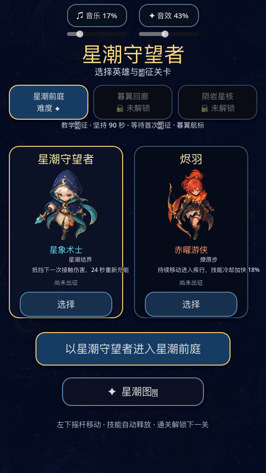
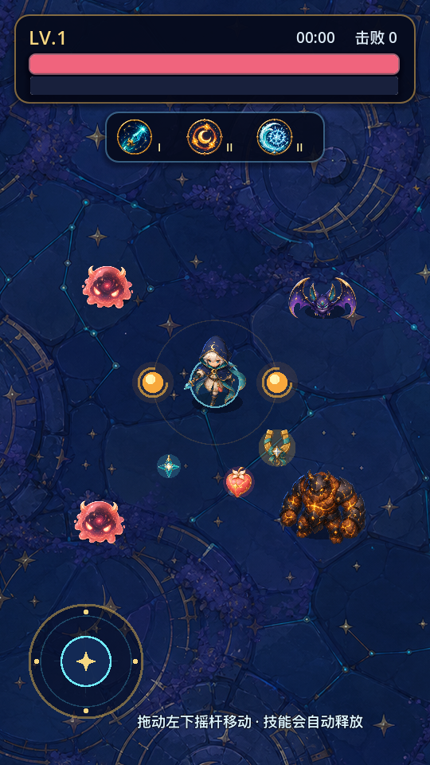
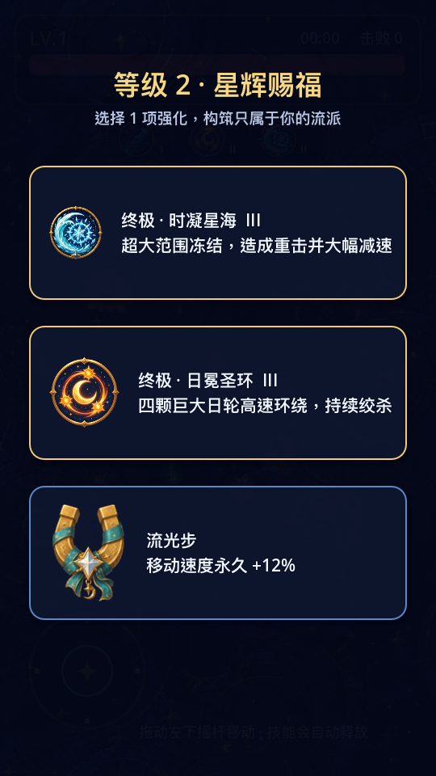
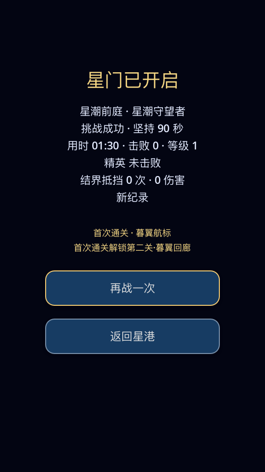

# 《星潮守望者》游戏现状汇报

> 报告日期：2026-07-15  
> 项目阶段：Godot 4.7 / 2D 竖屏生存肉鸽 MVP  
> 统计口径：当前工作目录中的实际代码、资源、关卡配置、自动化测试和导出预设；未实现内容不会计入完成项。

## 一、结论先行

《星潮守望者》已经从单关玩法原型升级为可连续游玩的三关战役 MVP，具备以下完整闭环：

**选择英雄与关卡 → 自动战斗与移动走位 → 击杀、掉落、拾取 → 升级三选一 → 技能进化 → 阶段与精英挑战 → 独立胜负结算 → 保存战绩 → 解锁下一关。**

当前版本适合内部演示和小范围真人试玩，不适合直接作为商业版本上架。基础玩法和工程结构已经稳定，下一阶段的主要矛盾不再是“功能缺失”，而是三关真实难度区分、地图内容差异、移动端真机质量和正式发布资产不足。

### 建议决策

| 决策项 | 建议 | 依据 |
| --- | --- | --- |
| 是否进入内部试玩 | 可以 | 三关、两名英雄、成长、胜负、解锁和存档闭环已通过自动化验证 |
| 是否继续立即扩英雄/装备/货币 | 暂缓 | 当前最缺的是跨英雄、跨关卡的真人数据，不是更多系统 |
| 是否进入 Android 正式发布 | 不建议 | 已有导出预设，但正式签名、图标、商店资料、设备矩阵和性能证据不足 |
| 下一阶段重点 | 先验证数值与手感 | 普通敌潮门禁已形成 1.00 → 1.19 → 2.39 的相对梯度，但模型不能替代真人通关数据 |

## 二、当前完成度

| 范围 | 状态 | 当前结果 |
| --- | --- | --- |
| 核心战斗闭环 | 已完成 | 移动、自动攻击、怪物追击、受伤、死亡、击杀、掉落、拾取 |
| 局内成长 | 已完成 | 经验升级、三选一、技能重复升级、III 级终极技能、通用强化 |
| 英雄内容 | 已完成 | 2 名英雄、6 项专属技能、2 项固有被动 |
| 战役关卡 | 已完成 | 3 关、10 个阶段段落、3 个独立精英事件、顺序解锁 |
| 胜负与结算 | 已完成 | 生存胜利、精英+生存组合胜利、超时失败、完美远征、再战/回主页 |
| 界面 | 已完成 | 开始页、英雄/关卡选择、HUD、暂停、升级、结算、图鉴、声音设置及全面屏安全区适配 |
| 本地持久化 | 已完成 | 英雄战绩、关卡战绩、解锁状态、上次选择、声音设置 |
| 方向表现 | 已完成 | 英雄与三类怪物的正面、侧面、左右镜像和平滑转身 |
| 音频 | 已完成 | 1 首循环背景音乐、13 类音效，音乐/音效独立开关和音量 |
| 自动化质量守卫 | 已完成 | 配置、刷怪、阶段、胜利、存档、英雄、战役、菜单闭环和结构检查 |
| Android 调试导出 | 已完成 | 已生成并校验 35 MB、arm64-v8a 调试 APK，包名和应用名正确，v2/v3 签名有效 |
| Android 正式发布 | 未完成 | 正式签名、应用图标、上架资料和系统化真机验证尚未形成交付证据 |

## 三、产品规格与内容规模

| 项目 | 当前值 |
| --- | --- |
| 引擎 | Godot 4.7 Stable |
| 类型 | 2D 竖屏、生存肉鸽、自动战斗 |
| 逻辑设计基准 | 540 × 960，运行时按实际比例扩展 |
| 屏幕适配 | 9:16、19.5:9、20:9、3:4 自动化布局覆盖，Android/iOS 安全区换算 |
| 渲染 | GL Compatibility |
| 可选英雄 | 2 |
| 专属技能 | 6，每项 I / II / III 三级 |
| 固有被动 | 2 |
| 战役关卡 | 3 |
| 阶段段落 | 10 |
| 普通怪物 | 3 类 |
| 精英事件 | 3 个，复用普通怪物基础类型并应用独立配置 |
| 拾取物 | 3 类：经验、治疗、磁吸 |
| 图鉴分类 | 4 类：英雄、怪物、道具、技能 |
| 音频事件 | 14：1 首 BGM、13 类音效 |
| Android 架构 | 当前预设仅启用 arm64-v8a |

## 四、玩家体验流程

### 4.1 开始界面

玩家可以：

1. 在“星潮守望者”和“烬羽”之间选择英雄。
2. 在已解锁关卡中选择本次远征；未解锁关卡按钮不可用。
3. 查看英雄定位、固有被动和英雄战绩摘要。
4. 查看当前关卡难度、关卡战绩和奖励名称。
5. 打开英雄、怪物、道具、技能四类图鉴。
6. 开关背景音乐/音效，并分别使用 0～100% 滑杆调节音量。

系统记住上次使用的英雄和关卡；如果记录中的关卡未解锁，会安全回退到第一关。

### 4.2 移动与自动战斗

- 桌面端使用 `WASD` 或方向键；移动端在左侧下半屏落指生成浮动摇杆。
- 玩家不需要手动瞄准，英雄技能按冷却自动锁定或按范围释放。
- 玩家被地图边界限制，镜头平滑跟随。
- 暂停、升级和结算会清除摇杆输入，避免恢复后继续移动。
- 右上角按钮或桌面端 `Esc` 可以暂停；暂停页可继续、返回主页并调整声音。

### 4.3 击杀、掉落与升级

- 所有怪物必掉经验，三类普通怪物分别提供 8、6、16 经验；精英经验由关卡独立配置。
- 普通怪物按关卡概率额外掉落治愈星心或星引护符，三关额外掉落总概率均为 9%。
- 治愈星心恢复 22 生命；星引护符提供 5 秒大范围磁吸。
- 普通拾取半径为 92，磁吸半径为 520。
- 第一次升级需要 28 经验，后续每级需求增加 20。
- 升级时游戏暂停并出现三选一；候选优先覆盖已有技能强化、未解锁专属技能和通用成长。
- 同一次经验获取可以跨越多级，系统会逐次补齐所有待选强化。

通用强化包括：最大生命 +25 并恢复 25、移动速度乘以 1.12、恢复 45；满生命时治疗兜底转为生命上限 +10 并恢复 10。

### 4.4 结算与解锁

结算显示关卡、英雄、结果、胜利目标、用时、击杀、等级、精英状态、英雄被动贡献和个人最佳。玩家可以同英雄同关卡再战，或返回开始页。

英雄战绩和关卡战绩分别记录：出征、通关、精英击败、最佳击杀、最高等级和最长生存时间。第一关默认解锁；通关第一、二关依次解锁下一关。

## 五、三关战役设计

| 关卡 | 核心定位 | 时长 / 阶段 | 地图 | 全局属性倍率 起→终 | 精英与胜利 | 奖励 |
| --- | --- | --- | --- | --- | --- | --- |
| 星潮前庭 | 教学、开阔、逐步引入三类怪物 | 90 秒 / 3 阶段 | 3200 × 3200 | 生命 1.00→1.857；速度 1.00→1.03；伤害 1.00→1.00 | 60 秒陨岩执政官；坚持 90 秒即可，击败精英为完美远征 | 暮翼航标，解锁第二关 |
| 暮翼回廊 | 狭长高速围猎，蝙蝠主导 | 105 秒 / 3 阶段 | 2100 × 3600 | 生命 1.08→2.00；速度 1.02→1.08；伤害 1.05→1.12 | 70 秒暮翼女王；必须击败并坚持 105 秒 | 星核坐标，解锁第三关 |
| 陨岩星核 | 紧凑重型敌潮，终局压力 | 120 秒 / 4 阶段 | 2200 × 2200 | 生命 1.18→2.25；速度 1.04→1.12；伤害 1.10→1.20 | 90 秒星核暴君；必须击败并坚持 120 秒 | 星门守望者，完成当前战役 |

### 第一关阶段

| 时间 | 阶段 | 刷新间隔 | 额外生成 | 史莱姆 / 蝙蝠 / 巨怪 |
| --- | --- | --- | ---: | ---: |
| 0～30 秒 | 星潮初启 | 0.90→0.74 秒 | 0% | 82% / 18% / 0% |
| 30～60 秒 | 暮翼围猎 | 0.70→0.55 秒 | 18% | 45% / 48% / 7% |
| 60～90 秒 | 陨岩审判 | 0.52→0.38 秒 | 30% | 28% / 32% / 40% |

### 第二关阶段

| 时间 | 阶段 | 刷新间隔 | 额外生成 | 史莱姆 / 蝙蝠 / 巨怪 |
| --- | --- | --- | ---: | ---: |
| 0～35 秒 | 暮色侵染 | 0.84→0.70 秒 | 4% | 58% / 39% / 3% |
| 35～70 秒 | 翼群折返 | 0.66→0.52 秒 | 18% | 28% / 62% / 10% |
| 70～105 秒 | 女王封锁 | 0.50→0.38 秒 | 30% | 18% / 52% / 30% |

### 第三关阶段

| 时间 | 阶段 | 刷新间隔 | 额外生成 | 史莱姆 / 蝙蝠 / 巨怪 |
| --- | --- | --- | ---: | ---: |
| 0～30 秒 | 岩潮叩门 | 0.78→0.66 秒 | 6% | 55% / 35% / 10% |
| 30～60 秒 | 重岩合围 | 0.64→0.52 秒 | 18% | 35% / 40% / 25% |
| 60～90 秒 | 星核过载 | 0.50→0.40 秒 | 28% | 22% / 35% / 43% |
| 90～120 秒 | 终焉审判 | 0.44→0.35 秒 | 35% | 15% / 30% / 55% |

完整公式、精英属性和压力模型见 [关卡数值设计](docs/LEVEL_DESIGN.md)。

## 六、英雄与技能

### 6.1 星潮守望者

| 属性 | 当前值 |
| --- | --- |
| 定位 | 均衡远程法师 / 控场生存 |
| 生命 / 移速 | 100 / 230 |
| 固有被动 | 星潮结界：抵挡下一次接触伤害，24 秒重新充能 |
| 初始技能 | 星芒枪 I |

| 技能 | I 级方向 | II 级方向 | III 级终极形态 |
| --- | --- | --- | --- |
| 星芒枪 | 单枚自动锁定星枪 | 双发、提伤、提频 | 星陨万华：5 枚高速星枪，可额外贯穿 2 个目标 |
| 日轮守卫 | 1 颗绕身日轮 | 2 颗并提高伤害 | 日冕圣环：4 颗巨大日轮，更快伤害判定 |
| 霜潮脉冲 | 范围伤害与减速 | 扩大范围、提伤、缩短冷却 | 时凝星海：245 范围、50 伤害、72% 减速、持续 2.3 秒 |

结界触发时会击退并减速攻击者；HUD 显示就绪或剩余充能，结算统计抵挡次数和伤害。

### 6.2 烬羽

| 属性 | 当前值 |
| --- | --- |
| 定位 | 高速爆发射手 / 机动输出 |
| 生命 / 移速 | 88 / 258 |
| 固有被动 | 燎原步：持续移动 0.9 秒后，技能冷却推进加快 18%；停止 0.55 秒后结束 |
| 初始技能 | 烬羽连矢 I |

| 技能 | I 级方向 | II 级方向 | III 级终极形态 |
| --- | --- | --- | --- |
| 烬羽连矢 | 单枚爆裂火箭 | 双发并扩大爆炸 | 百鸟朝阳：4 枚贯穿爆裂箭 |
| 陨星雨 | 轰击一处敌群 | 同时轰击两处 | 天火坠世：锁定四处敌群，62 伤害、96 范围 |
| 凤凰之心 | 周期伤害并治疗 2 | 扩大范围，伤害 28、治疗 4 | 不灭炎翼：205 范围、45 伤害、治疗 7 |

HUD 显示燎原步充能和激活状态，结算统计激活时长。

## 七、怪物、精英与战斗反馈

| 怪物 | 生命 | 移速 | 接触伤害 | 经验 | 角色定位 |
| --- | ---: | ---: | ---: | ---: | --- |
| 星蚀史莱姆 | 36 | 78.5 | 9 | 8 | 最常见的均衡单位 |
| 暮翼蝠 | 22 | 128 | 7 | 6 | 高速穿插单位 |
| 陨岩巨怪 | 105 | 50 | 16 | 16 | 高生命、高伤害重型单位 |

以上为基础值，生成时再乘当前关卡的时间难度倍率。精英复用对应普通怪物的移动与受伤逻辑，但拥有独立名称、金色表现、生命条、属性倍率、经验、额外升级和磁吸奖励。

战斗反馈包括伤害跳字、玩家受击红闪、全屏闪烁、镜头震动、怪物击退、0.46 秒受击保护、怪物受伤闪白、减速外圈、技能冷却条、释放闪光、阶段横幅、精英生命条和六套不同技能视觉。

方向表现采用“正面立绘 + 侧面立绘 + 右向镜像 + 程序化平滑混合与转身压缩”，可以明确表达左右移动，不属于逐帧行走动画。

## 八、界面、图鉴与声音

| 模块 | 当前功能 |
| --- | --- |
| 开始页 | 标题、3 关选择、2 英雄选择、战绩摘要、开始按钮、图鉴入口、声音设置 |
| HUD | 生命、经验、等级、时间、击杀、阶段、被动、磁吸、3 个技能槽、精英生命条、摇杆、暂停 |
| 暂停页 | 继续、返回主页、音乐/音效开关及音量 |
| 升级页 | 3 个候选、技能/通用图标、下一等级和效果说明 |
| 结算页 | 胜负标题、单局统计、被动贡献、纪录、奖励、再战、返回主页 |
| 图鉴 | 2 英雄、3 怪物、3 道具、6 技能 |

音频管理器包含 12 个音效播放器池，并对高频命中、击败、拾取和投射技能设置播放冷却，避免怪群战斗时音效叠加失控。声音设置使用独立本地配置持久化，开始页和暂停页通过事件保持同步。

## 九、工程结构与可维护性

原有集中在单个脚本中的关卡、战斗、升级、技能和 UI 职责已经拆分为以下层次：

- **配置层：**LevelConfig 及 Map、Difficulty、Loot、Stage、Elite、Victory、Reward 子配置。
- **单局层：**RunState、StageDirector、RunSession、RunWorldBuilder、RunResultService。
- **系统层：**怪物/刷怪、投射物、掉落、升级、技能、被动。
- **表现层：**地图绘制、战斗反馈和独立 UI 组件。
- **目录数据：**英雄/技能、普通怪物分别由单一目录提供基础数值。
- **持久化：**英雄战绩、关卡战绩、解锁和上次选择由 RunRecords 统一管理。

`game.gd` 现在只作为组合根，不包含具体关卡时长、阶段表或精英名称。所有第一方 GDScript 受 250 行上限约束，关卡配置层禁止依赖 UI 和运行系统。

详细边界见 [架构说明](docs/ARCHITECTURE.md)。

## 十、自动化验证结果

当前验证覆盖如下：

| 验证 | 通过标准 | 当前结果标识 |
| --- | --- | --- |
| Godot 项目加载 | 编辑器无脚本解析失败 | 已通过 headless editor load |
| 关卡目录 | 3 关、配置合法、逐怪物压力公式、关内/关间增长区间、奖励链 | `LEVELS_OK` |
| 阶段导演 | 边界正确、大步长不漏阶段、精英只触发一次 | `STAGES_OK` |
| 刷怪器 | 3 关权重、间隔插值、地图边缘与全面屏视口安全距离、固定种子可复现 | `SPAWNER_OK` |
| 胜利条件 | 生存、击败精英、组合条件、目标提示、超时和时间边界 | `VICTORY_OK` |
| 本地记录 | 持久化、英雄/关卡隔离、解锁链、旧数据兼容、损坏回退 | `RECORDS_OK` |
| 英雄系统 | 2 英雄、6 技能、2 被动、双向转身、叠加减速、弹道扫掠碰撞和暂停帧终止 | `HEROES_OK` |
| 战役冒烟 | 三关顺序解锁、精英按配置生成、每关独立胜利 | `CAMPAIGN_OK` |
| 游戏冒烟 | 菜单、会话、暂停、升级、胜利、解锁、14 个音频事件 | `SMOKE_OK` |
| 架构守卫 | 单文件 ≤250 行、配置隔离、组合根无关卡硬编码 | `ARCHITECTURE_OK` |
| 响应式布局 | 4 种比例、全屏覆盖、交互安全区、2 倍物理坐标换算 | `RESPONSIVE_OK` |
| 统一测试入口 | 10 组测试全部且仅执行一次、无引擎错误 | `ALL_TESTS_OK suites=10 responsive_profiles=4 engine_errors=false` |

这些测试证明配置和逻辑闭环成立，但不等同于真人手感、移动端性能或正式发布验收。

## 十一、Android 状态

项目已经具备 Android 导出预设：

- 应用标识：`com.xingchao.guardian`。
- 应用显示名：`星潮守望者`。
- 当前仅启用 `arm64-v8a`。
- 最低 Android API 24，目标 API 36。
- 竖屏、沉浸模式、edge-to-edge、安全区布局，无额外敏感权限。
- 当前已生成约 35 MB 的 `星潮守望者.apk`，并通过 APK v2/v3 调试签名校验；启动入口存在且指向 Godot 主 Activity。

正式发布仍缺少可审计的发布签名流程、正式应用图标、商店资料、明确固定的 Android 版本策略，以及覆盖不同芯片、系统版本、分辨率和刘海/挖孔屏的真机报告。因此“能导出调试包”和“可正式上架”必须作为两个里程碑管理。

## 十二、关键风险

### 12.1 压力代理已经递增，但仍不是通关率

修正后的压力模型按每类怪物的生命、伤害和速度独立计算，并扣除阶段喘息，三关全关代理值约为 1338、1598、3198。第二关较第一关提升 19.5%，第三关较第二关提升 100.1%，均处于预设门禁区间。该模型仍不包含地图面积、精英击杀时间、玩家构筑和操作水平，不能证明真实通关体验，必须继续真人验证。

### 12.2 三关地图尚未形成三套内容

三关有独立边界、色调、生成距离和战斗配置，但共用同一张地面纹理，没有障碍物、地形机关或独立地图事件。当前应表述为“三套关卡配置”，不应对外表述为“三张完整独立地图”。

### 12.3 第三关存在数值峰值风险

第三关末阶段压力代理达到 6792，星核暴君在出现时约有 1249 生命和 29.1 接触伤害，同时最终阶段巨怪权重达到 55%。如果玩家构筑不成型，90 秒后的失败可能从“可理解的操作失误”变成“数值碾压”。

### 12.4 移动端发布证据不足

自动化已经覆盖四种画面比例和合成安全区，但不能证明各 Android 厂商对刘海、挖孔和手势区的真实上报，也不能覆盖触控采样、弱机帧率、发热、音频延迟、后台切换和安装升级。掉落物当前也没有数量上限、超时回收或合并机制，高击杀长局可能累积较多节点。正式发布前需要单独的设备矩阵、节点数量观测与验收报告。

### 12.5 中长期留存内容尚未建设

当前局外系统只有关卡解锁和战绩，没有货币、装备、长期天赋、任务或账号。这不影响 MVP 验证，但不足以支撑长期留存目标。

## 十三、下一阶段建议

### P0：完成真人数值与真机验收

- 建议最低样本：两名英雄 × 三关 × 每种组合 5 局，共 30 局完整记录。
- 每局记录通关、死亡时间、击杀、最终等级、精英击杀时间、剩余生命和主观操作评分。
- 至少覆盖 1 台中低端和 1 台主流 Android 真机，检查帧率、触控、发热、音频、暂停恢复和安全区。

### P1：根据数据调整第二、三关

- 如果第二关与第一关通关率接近，说明地图和强制精英目标没有转化为实际难度，应优先调整中后段刷新间隔或蝙蝠/巨怪组合。
- 如果第三关失败集中在 90～100 秒，优先调整最终阶段密度或暴君生命，不同时修改两项。
- 以一次只改一个主变量的方式复测，避免无法归因。

### P2：增强关卡辨识度

- 为三关补充独立地面或装饰层。
- 在不改变核心循环的前提下加入少量地图机制，例如狭道视觉引导、星核危险区或阶段性环境反馈。
- 先验证一项地图机制，再决定是否扩展为完整地图系统。

### P3：准备 Android 发布链路

- 固化应用名、图标、版本号、最低/目标系统策略。
- 建立正式签名和密钥保管流程。
- 完成 APK/AAB、安装升级、权限、包体、崩溃和兼容性检查。

## 十四、汇报结论

当前项目已经完成“从玩法原型到三关可玩 MVP”的关键跨越：玩家可以选择两名机制不同的英雄，完成三关独立配置、逐关解锁的战役，并通过局内升级形成技能构筑；工程上也已将关卡配置、单局编排、战斗系统和 UI 分离，具备继续调数值和增加内容的基础。

现在最长期正确的动作不是继续堆功能，而是用 30 局结构化真人数据验证三个问题：第二关是否真的形成进阶、第三关终局是否公平、两名英雄是否都能稳定完成战役。完成这一轮验证后，再决定投入地图内容、局外成长还是正式发布，决策成本最低。
